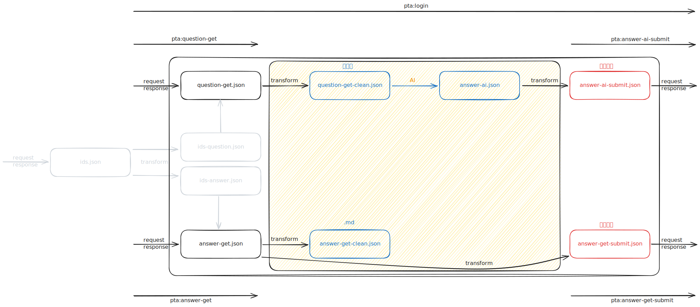

# Define

## ProblemType

> `ids` alias url

- Without ids

1. MULTIPLE_CHOICE
2. MULTIPLE_CHOICE_MORE_THAN_ONE_ANSWER
3. TRUE_OR_FALSE
4. FILL_IN_THE_BLANK

- With ids

1. PROGRAMMING
2. SQL_PROGRAMMING
3. SUBJECTIVE

## Url

```markdown

```

# Feature

## Login

- [x] `pnpm pta:login`

## Get question (including `ids*`)

- [x] `pnpm pta:question-get`
- [x] `ids*`

```shell
# data/workspace/topic
.
└── MULTIPLE_CHOICE
    └── question-get.json

# data/workspace/topic
.
└── PROGRAMMING
    ├── ids.json
    ├── ids-question-clean.json
    ├── ids-answer-clean.json
    └── question-get.json
```

## Transform question and answer (AI answer)

- [ ] `pnpm dev` transform & type (questionGetController, answerAiController)
- [ ] Auto generate target file! When it takes effect? Target file not exists ✅ Always run again ❌
- [ ] `pnpm data:reset` to force re-run (delete `*clean*` and `*.md`)
- [ ] Agent Skills: read `question-get-clean.json` -> generate answer -> write `answer-ai.json`

```shell
# data/workspace/topic
.
└── MULTIPLE_CHOICE  # or PROGRAMMING
    ├── question-get.json
    ├── question-get-clean.json          # generated by clean
    ├── question-get-clean.md            # mdify
    ├── answer-ai.json                   # generated by Agent Skills
    ├── answer-ai.md                     # mdify
    └── answer-ai-submit.json            # generated by clean
```

## Submit answer (AI answer)

- [ ] `pnpm pta:answer-ai-submit`

## Get answer (including `ids*`)

- [ ] `pnpm pta:answer-get`

```shell
# data/workspace/topic
.
└── MULTIPLE_CHOICE
    └── answer-get.json                  # fetched from other user

# data/workspace/topic
.
└── PROGRAMMING
    ├── ids.json
    ├── ids-question-clean.json
    ├── ids-answer-clean.json
    └── answer-get.json                  # fetched from other user
```

## Transform answer

- [ ] `pnpm dev` transform & type (answerGetController)

```shell
# data/workspace/topic
.
└── MULTIPLE_CHOICE  # or PROGRAMMING
    ├── answer-get.json
    ├── answer-get-clean.json            # generated by clean
    ├── answer-get-clean.md              # mdify
    └── answer-get-submit.json           # generated by clean
```

## Submit answer (Other user answer)

- [ ] `pnpm pta:answer-get-submit`
